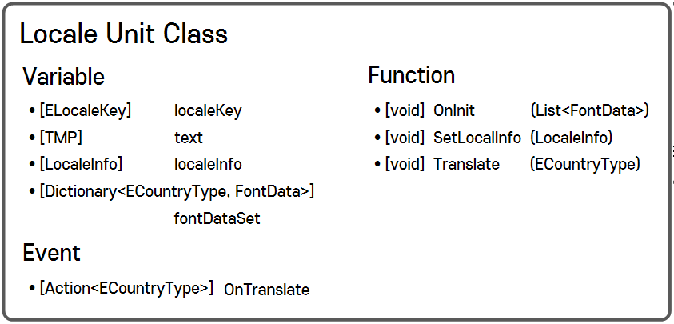

# Locale System

#### ⦁ [Locale System]은 인게임 내에 존재하는 [Text]를 원하는 국가의 언어로 번역해주는 시스템입니다.

#### ⦁ Version 1.0 (2023.08.22)

### 1. 데모 이미지

    

### 2. 조건

- Scene 내에 있는 모든 **'TextMeshProUGUI' 컴포넌트**들에 적용될 것
      
- 변수 할당 및 객체 간의 바인딩은 **최대한 [Editor Mode]에서 시도**할 것
  
- 번역에 필요한 데이터는 **[Table]화 된 정보를 활용**할 것

### 3. 메인 설계

- **Data 구조 설계**
  
  - **Data 구조**는 **JSON File을 설계할 때 활용**됨.

  - **[Data Class]([/LocaleSystem/ImageGroup/Locale_0.png"](https://github.com/MinjunISSAC/LocaleSystem/blob/main/LocaleSystem/Assets/LocaleSystem/Scripts/Locale/LocaleData.cs))**
    
  - **[JSON File](https://github.com/MinjunISSAC/LocaleSystem/blob/main/LocaleSystem/Assets/JsonLoader/Resources/JsonSet/%5BLocalizeSystem%5DSample.json)**
    

    

- **Json Parser 구조 설계**

  - **Json Parser**는 **Json File**과 **Data Class**를 파싱하는 역할
    
  - 파싱된 정보를 가져올 수 있도록 구성
 
  - **[Json Parser](https://github.com/MinjunISSAC/LocaleSystem/blob/main/LocaleSystem/Assets/JsonLoader/Scripts/JsonParser.cs)**
 

    

- **Locale Unit 구조 설계**

  - **Locale Unit**은 [Text] 컴포넌트에 할당
    
  - **[Text]의 내용**, **폰트**, **폰트 사이즈**를 직접적으로 수정하는 역할
    
  - 번역에 필요한 데이터들은 **[Locale Manager]에게 할당 받도록 설계**.
 
  - **[Locale Unit](https://github.com/MinjunISSAC/LocaleSystem/blob/main/LocaleSystem/Assets/LocaleSystem/Scripts/Locale/LocaleUnit.cs)**

    

- **Locale Manager 구조 설계**

  - 실질적으로 번역 명령을 내리는 **메인 클래스**
    
  - **[번역 기능]** 은 **event**를 통하여, 각 정보를 가지고 있을 **'Text' 컴포넌트들과 'UI'에 전달**
    
  - **[데이터 할당]** 은 초기화 시기에 **'Text' 컴포넌트들과 'UI'에 전달**
    
    - 할당 시도에 따라 Editor 모드에서 적용 가능한 부분은 Editor 모드에서 자동화  

  - **[Locale Manager](https://github.com/MinjunISSAC/LocaleSystem/blob/main/LocaleSystem/Assets/LocaleSystem/Scripts/Locale/LocaleManager.cs)**

    

- **기타**

    - **[LocaleTypeGenerate](https://github.com/MinjunISSAC/LocaleSystem/blob/main/LocaleSystem/Assets/LocaleSystem/Scripts/Locale/LocaleTypeGenerator.cs)**
 
      - Json File의 Key 값들을 Enum Script으로 생성하는 제너레이터
        
    - **[LocaleSelectView](https://github.com/MinjunISSAC/LocaleSystem/blob/main/LocaleSystem/Assets/LocaleSystem/Scripts/UI/LocaleSelectView.cs)**
 
      - 변경할 언어에 대한 선택 View

    - **[LocaleSelectBtn](https://github.com/MinjunISSAC/LocaleSystem/blob/main/LocaleSystem/Assets/LocaleSystem/Scripts/UI/LocaleSelectBtn.cs)**
 
      - 언어 선택 버튼
